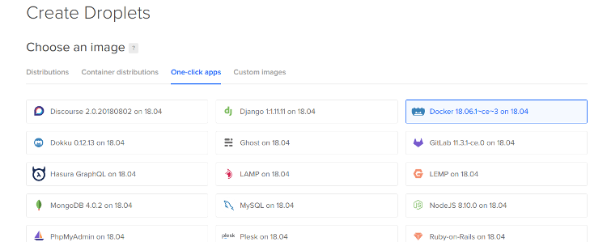

# Gitolite/Docker based deployment system


# Installation

## 1 Create Docker Server (DigitalOcean)



## 3 Setup Deployment System

Install gitolite and setup hooks
```
> ssh root@do-server-ip
# curl https://raw.githubusercontent.com/sudachen/keepmywork/master/setup_system | bash
# ^D
```

Build up keepmywork repository
```
> git clone git@do-server-ip:gitolite-admin
> cd gitolite-admin
```

Edit conf/gitolite.conf
```
repo gitolite-admin
    RW+     =   monster

repo keepmywork
    RW+     =   monster
```

and commit repo
```
> git commit -am "added repo keepmywork" && git push
> cd ..
```

Fork [sudachen/keepmywork](https://github.com/sudachen/keepmywork) on GitHub.

Upload keepmywork scripts and setup hooks
```
> git clone git@github.com:your-github-name/keepmywork
> cd keepmywork
> git remote add online git@do-server-ip:keepmywork
> make remote-rsa-key
```

## 4 Deploy Services and Apps

### Deploy NGINX Gate

```
> cd gitolite-admin
```

Edit conf/gitolite.conf
```
repo gitolite-admin
    RW+     =   monster

repo keepmywork
    RW+     =   monster

repo nginx-gate
    RW+     =   monster
```

Commit and Push changes to create new deployment repository
```
> git commit -am "added repo nginx-gate" && git push
> cd ..
```

Create repositiry nginx-gate on github

Deploy NGINX gateway
```
> git clone origin git@github.com:your-github-name/nginx-gate
> cd nginx-gate
> git remote add online git@do-server-ip:nginx-gate nginx-gate
> make deps
> cp -r .keepmywork/templates/nginx-gate/* .
> make certs
> git add . && git commit -am init && git push -u origin master
> make up
```

### Deploy MySQL Server

```
> cd gitolite-admin
```

Edit conf/gitolite.conf
```
epo gitolite-admin
    RW+     =   monster

repo keepmywork
    RW+     =   monster

repo nginx-gate
    RW+     =   monster

repo mysql-db
    RW+     =   monster
```

Commit and Push changes to create new deployment repository
```
> git commit -am "added repo mysql-db" && git push
> cd ..
```

Create repositiry mysql-db on github

Deploy MySQL server
```
> git clone git@github.com:your-github-name/mysql-db
> cd mysql-db
> git remote add online git@do-server-ip:mysql-db mysql-db
> make deps
> cp -r .keepmywork/templates/mysql-db/* .
> make certs
> git add . && git commit -am init && git push -u origin master
> make up
```

Connect to MySQL and change root password
```
> mysql -h do-server-ip -uroot -ptoor --ssl-ca=certs/mysqld-ca.pem --ssl-cert=certs/mysql-root-cert.pem --ssl-key=certs/mysql-root-key.pem

mysql > alter user 'root'@'%' identified by 'new-root-password';

mysql > \q
```

Create webapp user and database
```
> mysql -h do-server-ip -uroot -pnew-root-password --ssl-ca=certs/mysqld-ca.pem --ssl-cert=certs/mysql-root-cert.pem --ssl-key=certs/mysql-root-key.pem

mysql > create database webapp;

mysql > grant all on webapp.* to 'webapp'@'192.168.168.0/255.255.255.0' identifiied by 'password';
mysql > grant all on webapp.* to 'webapp'@'%' identified by 'password' require subject '/O=CLIENT/CN=user';

mysql > \q
```

Check webapp user connection
```
> mysql -h do-server-ip -uwebapp -ppassword --ssl-ca=certs/mysqld-ca.pem --ssl-cert=certs/mysql-user-cert.pem --ssl-key=certs/mysql-user-key.pem

mysql > \q
```

