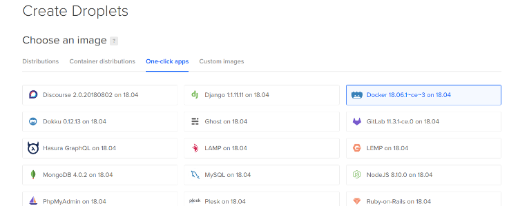

# Gitolite/Docker based deployment system


# Installation

## 1 Install Docker Server (Via DigitalOcean)



## 2 Install GitoLite

```
> ssh root@do-server-ip
# useradd -r -m -s /bin/bash git
# usermod -a -G docker git
# exit
# scp ~/.ssh/id_rsa.pub root@do-server-ip:/home/git/monster.pub
# ssh root@do-server-ip
# sudo -i -u git
$ git clone https://github.com/sitaramc/gitolite
$ mkdir bin
$ gitolite/install -to $HOME/bin
$ bin/gitolite setup -pk monster.pub
$ ^D^D
```

## 3 Setup Deployment System

